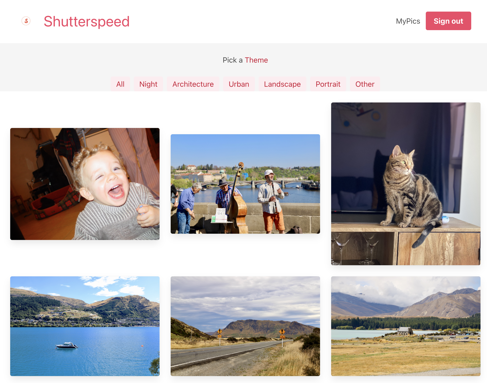
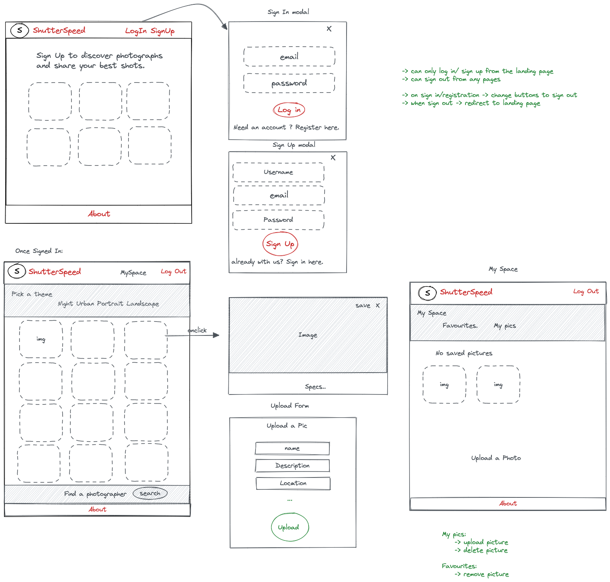
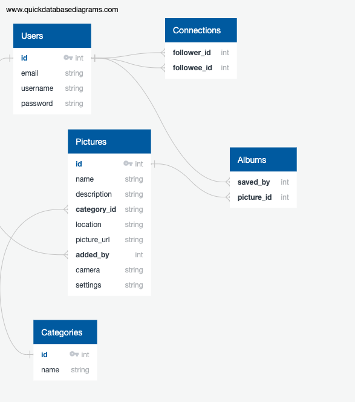
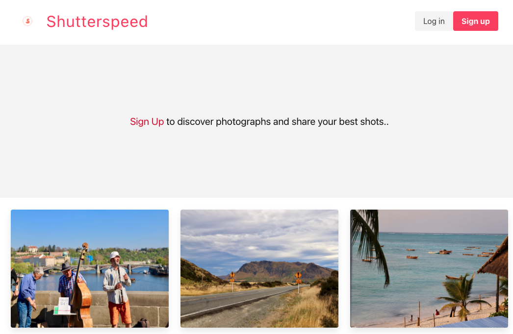
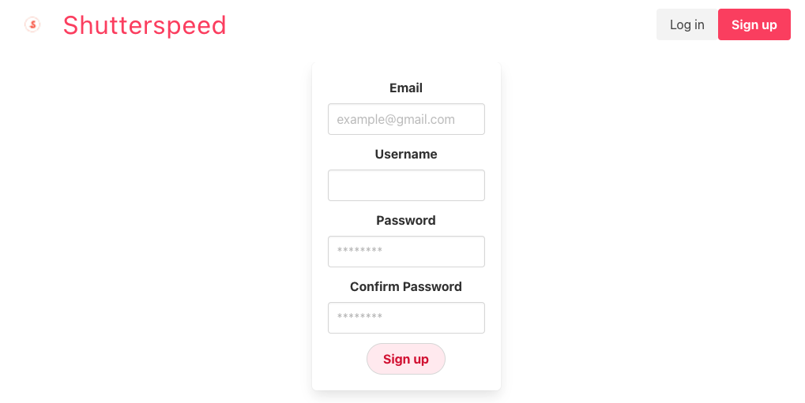
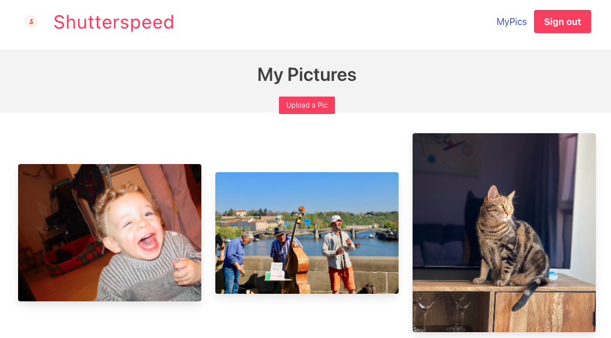
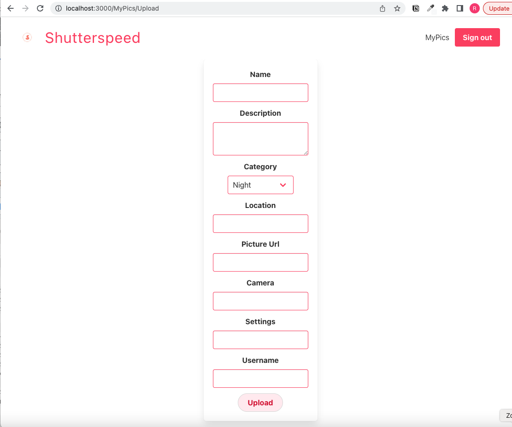

# SEI Project 4: Shutterspeed

## Project Overview

Shutterspeed is an application designed for photography enthusiasts. The idea is to allow users to share their best shots with peers. Each picture comes with a full description of the settings, location etc.

The app has been deployed with Netlify/Heroku and is available [https://shutterspeed-react.netlify.app].





## Brief


* Build a full-stack application by making your own backend and your own frontend.
* Use a Python Django API using Django REST Framework to serve your data from a Postgres database.
* Consume your API with a separate front-end built with React.
* Be a complete product which most likely means multiple relationships and CRUD functionality for at least a couple of models.
* Be deployed online so it’s publicly accessible.

## Technologies Used

Frontend

* React.js
* Axios
* React router dom
* Bulma

Backend

* Python
* Django
* Django REST Framework
* PostgreSQL

Development Tools

* Insomnia
* TablePlus
* Git & GitHub
* npm / poetry
* Excalidraw

Deployment

* Heroku
* Netlify

## Development

1. Front-end Design



2. Data Models



3. Django Models


```
from django.db import models

# Create your models here.

CATEGORY = [
    (1, 'Night'),
    (2, 'Landscape'),
    (3, 'Urban'),
    (4, 'Architecture'),
    (5, 'Portrait'),
    (6, 'Other')
]

class Picture(models.Model):
    """
    A model for pictures.
    """

    name = models.CharField(max_length=150)
    description = models.CharField(max_length=100)

    category = models.IntegerField(
        choices=CATEGORY
        )

    location = models.CharField(max_length=50)
    picture_url = models.URLField()
    camera = models.CharField(max_length=30)
    settings = models.CharField(max_length=50)

    added_by = models.ForeignKey(
        'users.User',
        related_name='added_picture',
        on_delete=models.DO_NOTHING,
        blank=True
    )

    def __str__(self):
        """Formats entries in the Admin panel"""
        return f'{self.name}'

```

4. React App







## Limitations

Due to the time constraint, the following functionalities are yet to be implemented:

* filter pictures on theme (tags currently inactive)
* find a photographer (selection currently without options)
* follow a photographer and save/download a picture
* allow user to edit/delete his own picture
